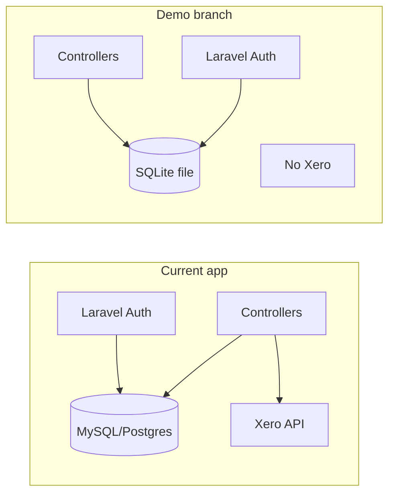

# Demo Branch: SQLite, No Xero, Vercel Deploy

## 1. Branch and scope

- Create a new branch (e.g. `demo` or `coded-demo`) from the current branch.
- All work below is done on this new branch.

## 2. Remove all Xero API integrations

**Files to delete**
- [app/Http/Controllers/XeroController.php](app/Http/Controllers/XeroController.php)
- [app/Models/XeroToken.php](app/Models/XeroToken.php)
- [config/xero.php](config/xero.php)
- [database/migrations/2026_02_05_000000_create_xero_tokens_table.php](database/migrations/2026_02_05_000000_create_xero_tokens_table.php)
- [app/Console/Commands/RefreshToken.php](app/Console/Commands/RefreshToken.php)
- [app/Console/Commands/GetCustomers.php](app/Console/Commands/GetCustomers.php)
- [app/Console/Commands/GetInvoices.php](app/Console/Commands/GetInvoices.php)
- [app/Console/Commands/PostInvoiceAttachment.php](app/Console/Commands/PostInvoiceAttachment.php)

**Code changes**
- [routes/web.php](routes/web.php): Remove the four Xero routes (lines 77–81).
- [composer.json](composer.json): Remove `"webfox/laravel-xero-oauth2": "^4.1"`, then run `composer update` (and remove `config/xero.php` from published config if present).
- [app/Console/Kernel.php](app/Console/Kernel.php): Remove the `xero:refresh_token` schedule entry.
- [app/Http/Controllers/ClientsController.php](app/Http/Controllers/ClientsController.php): Remove `use App\Models\XeroToken` and the Xero block in the store/update logic (lines ~253–272): skip the "Xero not connected" check and the Guzzle POST to create/update Contact; keep only local create/update of `Client` (and ensure `ContactID` is optional or set to a placeholder).
- [app/Http/Controllers/JobsController.php](app/Http/Controllers/JobsController.php): Remove `use App\Models\XeroToken`. In `generateInvoice` (and related flow): remove all Xero API calls (POST Invoices, GET OnlineInvoice, `sendAttachments` and any other Xero attachment uploads). Keep only local creation/update of `Invoice` and `LineItem` (and any `AdminFootprint`) using data you already have (e.g. build invoice number and totals in app instead of from Xero). Remove or stub `sendAttachments` and `sendRequestWithRarFile` so they do not call Xero.
- [app/Http/Controllers/InvoiceController.php](app/Http/Controllers/InvoiceController.php): Remove `use App\Models\XeroToken`. In `voidInvoice`: remove the Guzzle POST to Xero; only update local invoice status (e.g. set status to VOIDED in your store and return success).

**Config / bootstrap**
- Remove Xero provider and facade from [config/app.php](config/app.php) if registered there (Laravel may auto-discover from composer; removing the package handles it). Clear `bootstrap/cache/*` after composer changes so discovery is refreshed.

## 3. Use SQLite (no MySQL/Postgres)

- **Goal:** Use a single SQLite file as the only database. No MySQL or Postgres; no controller or Eloquent refactor.
- **Implementation:**
  - In [config/database.php](config/database.php), ensure the `sqlite` connection is defined (Laravel default). Set the default connection to `sqlite` for the demo, or rely on `.env`.
  - In `.env` (and Vercel env): `DB_CONNECTION=sqlite`, `DB_DATABASE=<path to sqlite file>`. Locally use e.g. `database/database.sqlite`; on Vercel use `/tmp/database.sqlite` (writable; data is ephemeral across cold starts).
  - Create the SQLite file if missing (e.g. `touch database/database.sqlite`), then run all migrations **except** the Xero one (already removed in step 2): `php artisan migrate`.
  - No code changes to controllers or models: they keep using Eloquent and `DB::` as they do now.

## 4. Demo login (single user)

- **Credentials:** email `siena@admin.com`, password `admin123`.
- **Approach:** Use Laravel's default auth with the SQLite database. Ensure the only user in the database is this demo user.
- **Implementation:**
  - Add a database seeder (e.g. [database/seeders/DemoUserSeeder.php](database/seeders/DemoUserSeeder.php)) that:
    - Truncates or deletes existing users (optional, for a clean demo), then creates one user: email `siena@admin.com`, password hashed with `Hash::make('admin123')`, and the same attributes your [User](app/Models/User.php) model and app expect (e.g. `name`, `roles` = `admin`).
  - Run the seeder after migrations: `php artisan db:seed --class=DemoUserSeeder` (or register it in [DatabaseSeeder](database/seeders/DatabaseSeeder.php) and run `php artisan db:seed`).
  - No custom user provider or auth config changes needed; login form works as-is against SQLite.

## 5. Vercel deployment (SQLite in /tmp)

- **Constraint:** Deploy to Vercel with SQLite as the only database. The SQLite file will live in `/tmp`, so data is ephemeral (resets on cold starts) unless you later add something like Vercel Blob to persist the file.
- **Required additions:**
  - **api/index.php** at project root (Vercel serverless entry):
    - Contents: `<?php require __DIR__ . '/../public/index.php';`
  - **vercel.json** at project root:
    - Use `version: 2`, route all requests to `api/index.php`, set `functions` to use the `vercel-php` runtime for that file.
    - Set env so Laravel uses `/tmp` for cache and sessions and SQLite: e.g. `DB_CONNECTION=sqlite`, `DB_DATABASE=/tmp/database.sqlite`, `VIEW_COMPILED_PATH=/tmp`, `CACHE_DRIVER=file`, `SESSION_DRIVER=file` (with session path in `/tmp` if needed).
  - **.vercelignore**: Exclude `vendor`; optionally exclude `.env` and other dev artifacts.
- **Laravel env for Vercel:** Set `APP_ENV=production`, `APP_DEBUG=false`, `DB_CONNECTION=sqlite`, `DB_DATABASE=/tmp/database.sqlite`. Ensure migrations run at build time if you want a fresh schema (e.g. in build command run `php artisan migrate --force`); the SQLite file will be created in `/tmp` at runtime if not present.
- **Note:** Laravel on Vercel runs as serverless; cron/scheduler is not available. The removed `xero:refresh_token` is not needed.

## 6. Order of work (suggested)

1. Create the new branch.
2. Remove Xero (delete files, routes, composer dependency, and all Xero usage in controllers and Kernel).
3. Configure SQLite: set `DB_CONNECTION=sqlite` and `DB_DATABASE` in `.env`, create `database/database.sqlite`, run migrations (Xero migration already removed).
4. Add and run the demo user seeder (siena@admin.com / admin123).
5. Add Vercel config (`vercel.json`, `api/index.php`, `.vercelignore`) and set production env to use SQLite with `DB_DATABASE=/tmp/database.sqlite`.

---

## Summary diagram

## Clarifications you may want to confirm

- **Persistence on Vercel:** With SQLite in `/tmp`, data resets on cold starts. For persistent data, you could later add Vercel Blob (or similar) to store and restore the SQLite file.
- **Branch name:** Use `demo`, `coded-demo`, or another name when creating the branch.
